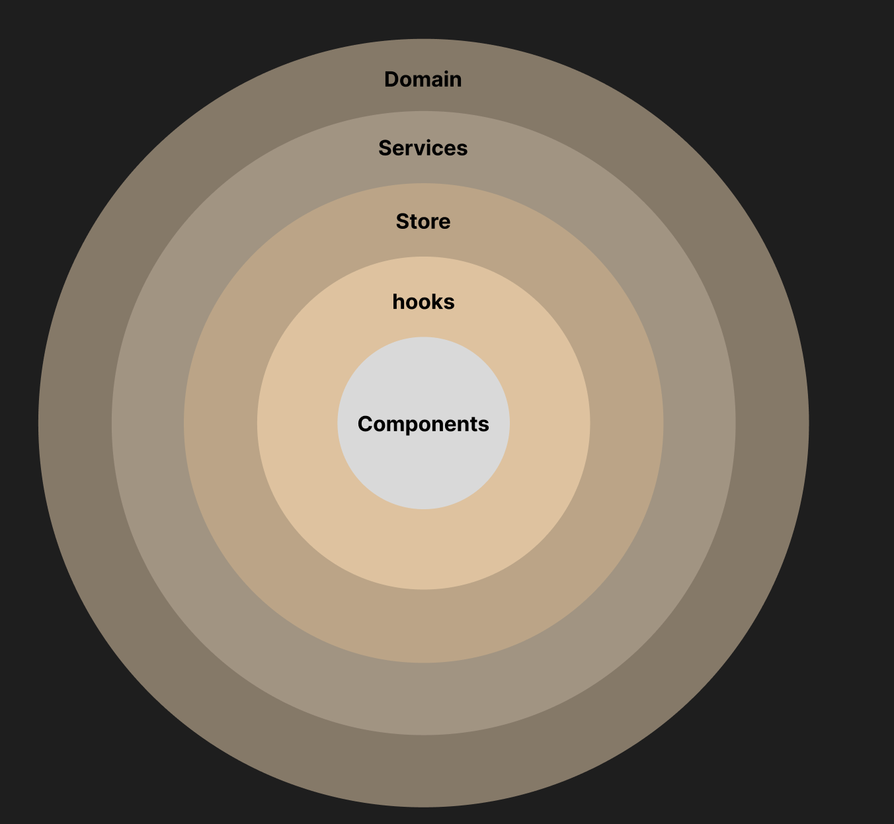

# Readme

## Lancement de l'application

1. Téléchargez l'application Expo Go sur mobile
2. Faites `npm install` dans le terminal
3. Connectez votre mobile et votre laptop sur le même wifi 
4. Faites: `make start` dans le terminal
5. Vous devez appuyer sur `s`pour switcher vers Expo Go
5. Ouvrez Expo Go et scannez le QR code la première fois (sinon retrouvez le projet direct dans l'app)

-----------------------------
## Documentation d'Expo

Expo est un framework basé sur React Native permettant d'accélérer le développement Cross Platform.
- [Expo documentation](https://docs.expo.dev/): Learn fundamentals, or go into advanced topics with our [guides](https://docs.expo.dev/guides).

-----------------------------

## Get started

In the output, you'll find options to open the app in a

- [development build](https://docs.expo.dev/develop/development-builds/introduction/)
- [Android emulator](https://docs.expo.dev/workflow/android-studio-emulator/)
- [iOS simulator](https://docs.expo.dev/workflow/ios-simulator/)
- [Expo Go](https://expo.dev/go), a limited sandbox for trying out app development with Expo

You can start developing by editing the files inside the **app** directory. This project uses [file-based routing](https://docs.expo.dev/router/introduction).

## Architecture



```
.
├── app
│   ├── _layout.tsx
│   ├── storeProvider.tsx
│   ├── index.tsx    //Route '/'
│   ├── exemple     //Route '/exemple'
│       ├── index.tsx
│       ├── style.css
│
├── assets      //mettre ici tous les médias (images, icônes...)
|
├── constants      //les datas en dures qui ne bougent jamais, style des enums
│
├── components      //mettre ici tous les gros composants (un dashboard par exemple ou un menu)
│   ├── exemple
│       ├── exemple.tsx
│       ├── style.css
│   ├── ui      //Petits composants réutilisables dans les gros composants (un bouton ou un texte par exemple)
│       ├── button.tsx
│       ├── style.css
|
├── services      //les calls api
|
├── models      //les types
|
├── domain      //logique métier de l'application, c-a-d class avec méthodes (un utilisateur, une sonde, un potager)
|
├── store      // gestions du store
│   ├── actions // déclencher les actions
│   ├── selectors // récupérer les datas du store
│   ├── reducers // déclaration d'un élément dans le store
│   ├── hooks.tsx // ne pas toucher
│   ├── store.tsx // partage dans le store
```

## Get a fresh project

When you're ready, run:

```bash
npm run reset-project
```

This command will move the starter code to the **app-example** directory and create a blank **app** directory where you can start developing.

## Learn more

To learn more about developing your project with Expo, look at the following resources:

- [Expo documentation](https://docs.expo.dev/): Learn fundamentals, or go into advanced topics with our [guides](https://docs.expo.dev/guides).
- [Learn Expo tutorial](https://docs.expo.dev/tutorial/introduction/): Follow a step-by-step tutorial where you'll create a project that runs on Android, iOS, and the web.